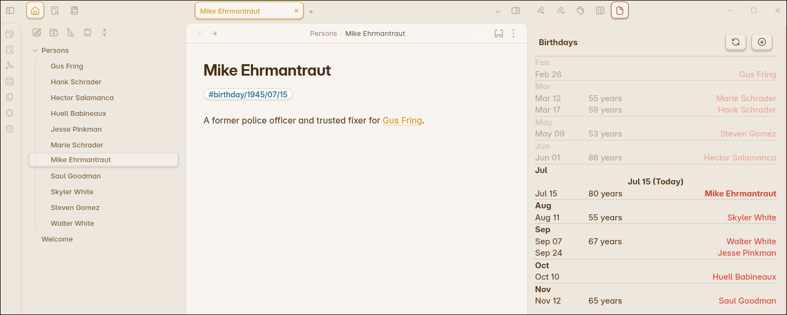

# Obsidian plugin: Simple Birthday

A simple Obsidian plugin to track and display upcoming birthdays in your vault.

---



## Usage

Add a birthday tag to any note using one of the following formats:

```
#birthday/MM/DD           (e.g. #birthday/07/11)
#birthday/YY/MM/DD        (e.g. #birthday/86/07/11)
#birthday/YYYY/MM/DD      (e.g. #birthday/1986/07/11)
```

- The note title will be used as the person's name.
- If a year is provided, the plugin will calculate and display the age.
- All birthdays are shown in a sidebar panel, grouped by month, with today’s birthdays highlighted.

Click the birthday cake icon in the ribbon or use the command palette to open the birthday sidebar.

## Settings

The plugin settings include:

- An information section explaining how to use the plugin and the tag format.
- No configuration is required—just add birthday tags to your notes!

---

> This plugin is inspired by other birthday trackers, but uses a simple tag-based approach for maximum flexibility.
